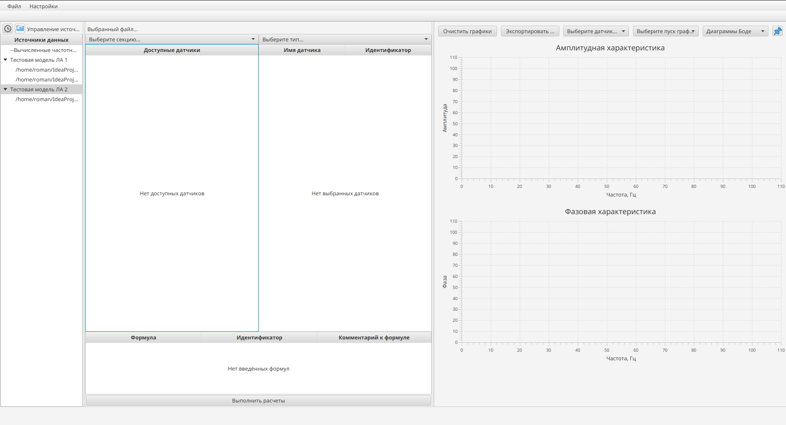
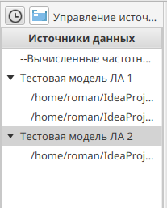
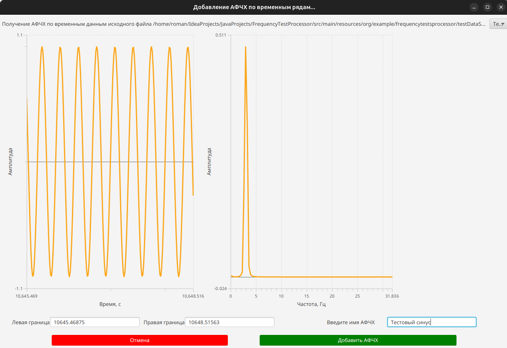
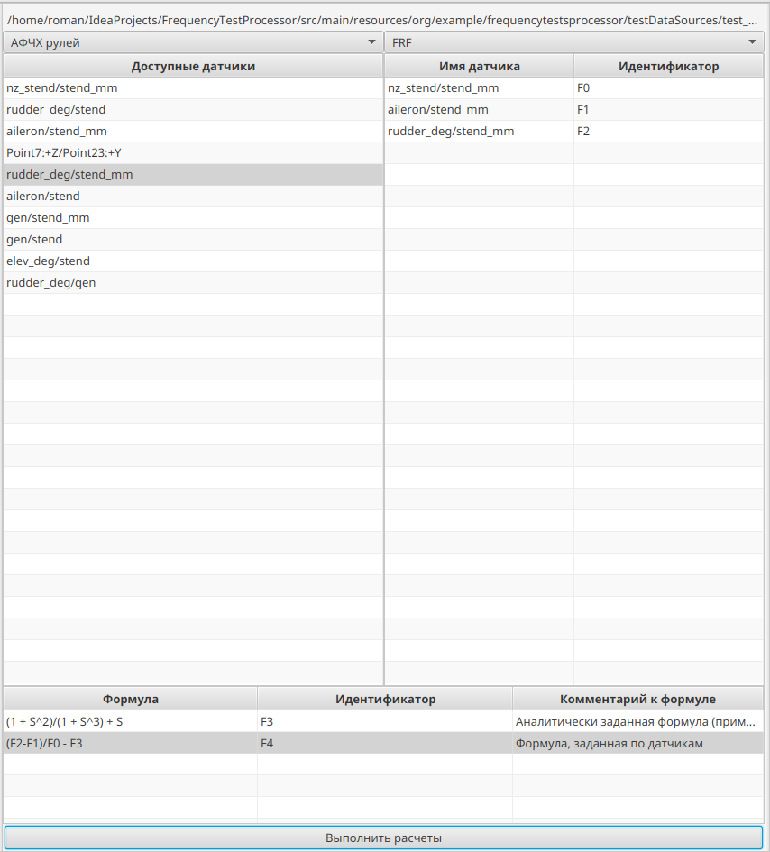
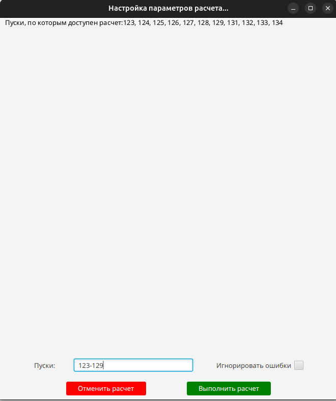
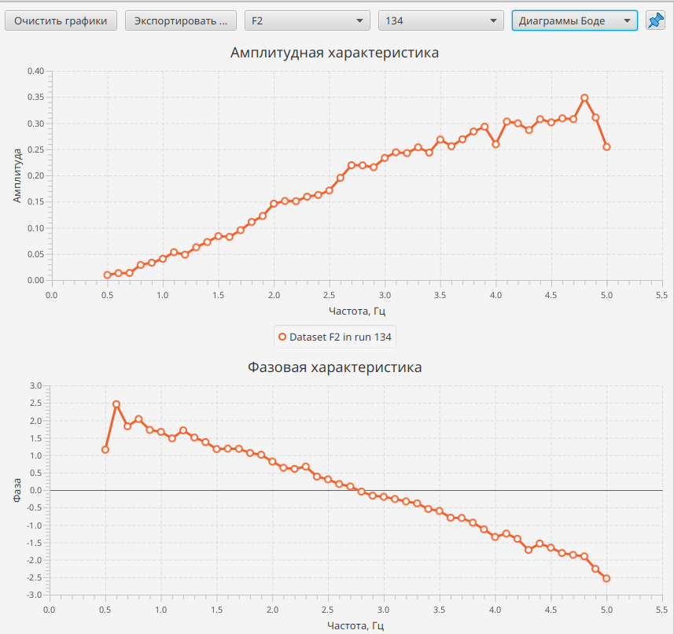
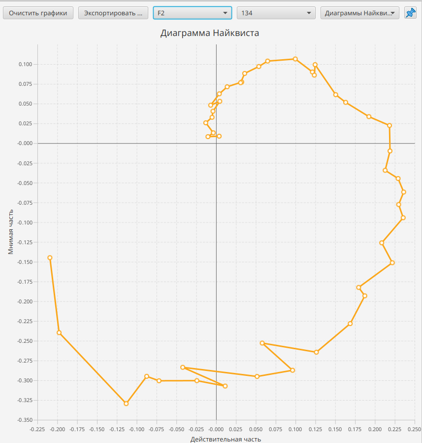

# FrequencyTestsProcessor. What is it?
This project implements a user interface for convenient processing of frequency and timeseries data in different formats(**.csv**, **.uff** and more).

Processing includes:
- Building graphs according to the data
- Saving data to database
- Calculation of expressions with frequency data  treated as complex functions
- Performing of fourier transforms with timeseries data
- Wide support of .uff files with setting up calculation by runs according to user-defined expressions and parameters


More features will be added in the future.

# Building and running
If you want to build project from sources or you want to participate in development, you need to install following tools:
- JDK 21
- Maven 3.8.7
- Python 3.12.5
    - pyuff 2.4.6
    - numpy 2.2.4
    - jep 4.2.0
- Any IDE with Maven support

### Important issure: installation of JEP
This project uses JEP library for parsing expressions in uff files. It might be difficult for the frst time to link JEP to application, so here is step-by-step guide, which will allow you setup work environment.

#### 0. Install any IDE with Maven support and get project sources with ```git clone https://github.com/RomanPugachev/FrequencyTestProcessor.git```

#### 1. Install JDK 21, python 3.12.5 and maven 3.8.7
Depending on your OS, you can download them from the links below:
- Java can be downloaded from [here](https://www.oracle.com/cis/java/technologies/downloads/#java21).
- Python can be downloaded from [here](https://www.python.org/downloads/).
- Maven can be downloaded from [here](https://maven.apache.org/download.cgi).
#### 2. Install python packages by run
```
pip install numpy==2.2.4
```
```
pip install pyuff==2.4.6
```
```
pip install jep==4.2.0
```

#### 3. Setup following environment variables for JEP:
- JAVA_HOME="/path/to/used/jdk" (e.g. `/home/user/.jdks/openjdk-21.0.1`)
- JEP_HOME="/path/to_python_site_packages/site-packages/jep/{libjep.so,  libjep.jnilib,  jep.dll depending on OS}" (e.g. `/home/user/.pyenv/versions/3.12.5/lib/python3.12/site-packages/jep/libjep.so`)
- PYTHONHOME=/path/to_python_directory (e.g. `/home/user/.pyenv/versions/3.12.5`)
- PYTHONPATH=/path/to/python_site-packages (e.g. `/home/user/.pyenv/versions/3.12.5/lib/python3.12/site-packages`)

# Usage example (might be outdated)
When you set up environment and got project sources, you can build and run project. As application starts, you will see main window,
which looks like this:



In following sections, we will describe main features of application. Note that you can change database configuration in src/main/resources/org/example/frequencytestsprocessor/hibernate.properties file. Current configuration uses SQLite and file in project directory.

Some screenshots might be outdated. 

### 1. Importing data
At the moment, application supports importing data in following formats:
- .uff files for frequency data
- .csv files for timeseries data
Area for importing data is located on the left side of the main window and looks like this:



For importing timeseries data, you need to click on clock icon and select file with data in .csv format.

For importing frequency data, you need to click on frequency icon and select file with data in .uff format.

After importing data, you will see data in table below. This table contains sources, which are stored in database and available for processing in application. Depending on source type, you will follow different opportunities for data processing.

### 2. Processing timeseries data
 Each timeseries source, represented by its name, contains timestamps data and of columns with their values(timeseries). Each timeseries is represented by its name, and  contains values from corresponding column. Supposed, that timestamps from source file are shared by all timeseries.
 
When you select timeseries source, you will see following window:



In this window, you can choose timeseries for further processing. On the left side you can see chart with timeseries data.
On the right side DFT transform of timeseries is shown. You can choose area from timeseries chart to set limits of data for 
performing DFT transform. By double-clicking on chart, you can reset limits. On transformed data chart, you can zoom in chosen area and reset zoom by double-clicking on chart.
When you inserted name for result spectrum, you can save it in database.

### 3. Processing frequency data
Each UFF source with frequency data contains number of UFF58 datasets, where frequency data is stored.
Each UFF58 dataset contains array with frequency data and array with corresponding timestamps. Also it contains information about section, type of frequency data, name of measuring point and run of measurement.

Following part of main window allows you to choose section, type of frequency data and sensors for processing:



After choosing previous parameters, you can define formulas for calculating new frequency data, using Identifiers of previously chosen sensors and other formulas for sensor-based formulas; and S-parameter in formulas, which representing complex functions, where ***S*** will be used as complex ***i&omega;***

You can choose runs, which you want to process (for now, choicebox with ignoring errors is not implemented) in this dialog window:



After successful processing, calculated data will be stored in database and you will be able to see results in Bode and Nyquist plots like this:



